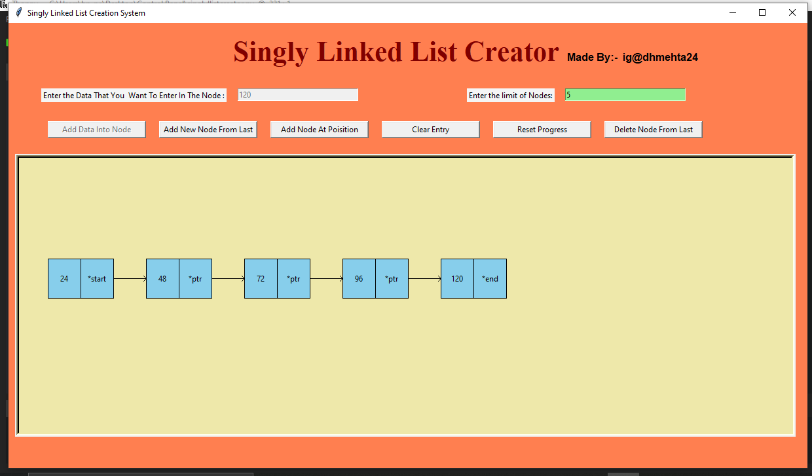

# Singly linked list creator

A GUI Application that draws a singly linked list in canvas of tkinter.

Singly Linked List Creator is a classic GUI application that can draw nodes which are connected to the previous node and creates a linked list drawing.This app will helpful to visualize singly linked list and node insertion operation.This app is still under development.The app contains operations like node insertion and deletion at last and node insertion at specific position(still under develoment).

# Overview

To create a linked list,First set the limit of node which are maximum nodes in linked list.After that, just type the data that you want to enter in the given node and then press Add Data Into Node button.To create a new node in linked list press Add New Node From Last button.
If you want to clear the current linked list, just press Reset Progress button.To delete nodes, press Delete Node From Last.To clear enterd data into entry bar click Clear Entry.Then remaining button is for add node at specific position.Remember,  this command is under development using that button may create some bugs in application.The another feature is that the application contains shorcut keys.To add data into node just type data in entry bar and press Enter.Simillarly to create new node just press left shift key.

# Application Structure

The application generally consist of buttons, labels and canvas drawings. When Add Node From Last is presed it will draw a structure of node like a square and a separator line which divides the square into two components : Data and Pointer.
The data is a container which holds the data which is given by user input.
The pointer which is connected to data container holds the address of that data which is stored into memory.
When more than one nodes created, they are connected to each other by arrow which is generally  a pointer which is pointing to next node.

# Screenshot

